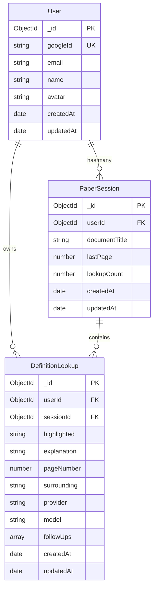
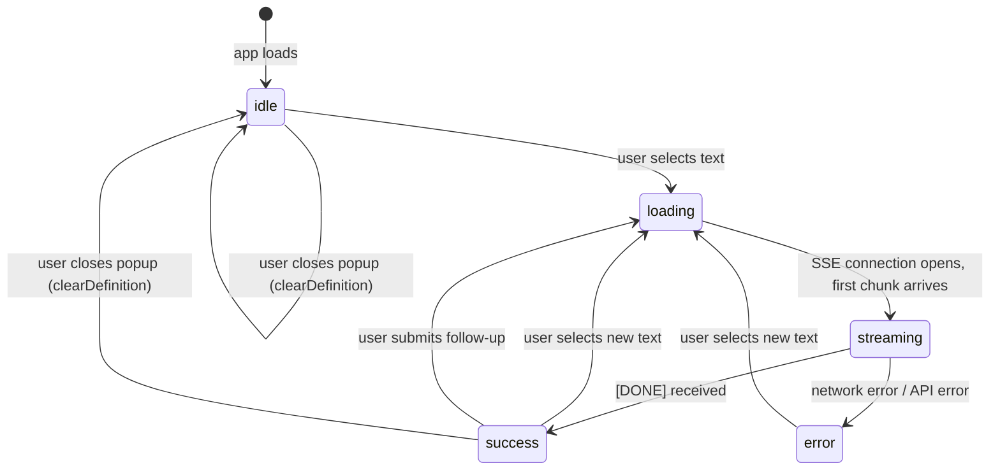
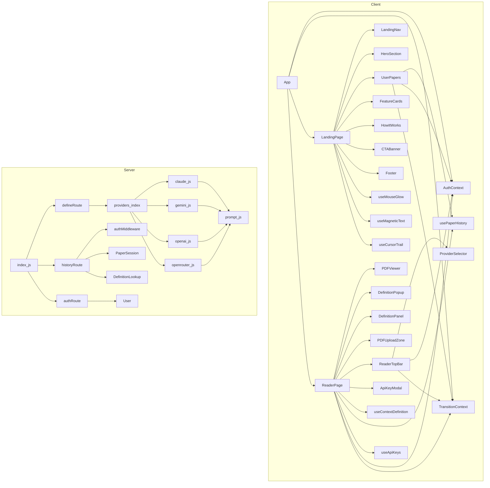

# ContextLens — Complete Technical Documentation

> **Audience:** New contributors, architecture learners, and senior engineers.  
> **Generated from:** Full workspace analysis — every file, config, and dependency.

---

## Table of Contents

1. [Project Overview](#1-project-overview)
2. [Core Principles & Philosophy](#2-core-principles--philosophy)
3. [Tech Stack — With Reasoning](#3-tech-stack--with-reasoning)
4. [High-Level Architecture](#4-high-level-architecture)
5. [Folder & File Structure](#5-folder--file-structure)
6. [Key Concepts & Glossary](#6-key-concepts--glossary)
7. [Data Models & Entities](#7-data-models--entities)
8. [Module-by-Module Deep Dive](#8-module-by-module-deep-dive)
9. [API / Interface Reference](#9-api--interface-reference)
10. [State Management](#10-state-management)
11. [Setup & Installation](#11-setup--installation)
12. [How to Run](#12-how-to-run)
13. [Testing Strategy](#13-testing-strategy)
14. [Contribution Guide](#14-contribution-guide)
15. [Recurring Patterns in This Codebase](#15-recurring-patterns-in-this-codebase)
16. [Gotchas & Things That Will Trip You Up](#16-gotchas--things-that-will-trip-you-up)
17. [Dependency Map](#17-dependency-map)
18. [Roadmap (Inferred from the Code)](#18-roadmap-inferred-from-the-code)

---

## 1. Project Overview

ContextLens is an AI-powered PDF reading assistant that solves a specific, universal problem: reading dense material (research papers, legal briefs, medical literature) and hitting terminology you don't understand breaks your flow. Opening a new tab, searching the term, and reading a generic definition loses the thread of the original text. ContextLens eliminates this by rendering any uploaded PDF in an in-browser reader and, when you highlight a word or phrase, instantly streaming an AI-generated explanation that is **grounded in that specific document** — not a dictionary entry, but an answer to: *"what does this mean in the context of this particular paper?"*

**Who it is for:** Researchers, graduate students, professionals reading outside their primary domain, and curious readers who work with dense PDFs regularly.

**What problem it solves:** Generic definitions ignore context. The term "synaptic plasticity" means something precise in a neuroscience paper and something loose in a pop-science blog. ContextLens feeds the surrounding 300 characters and the document title to the AI model alongside the highlighted phrase, producing explanations calibrated to the text being read.

**Key Features:**

- **PDF Upload & Render** — drag-and-drop any PDF; all pages render in a scrollable reader with zoom support
- **Highlight → Explain** — select any text; a draggable floating popup streams a context-aware AI explanation in real time, with a one-click copy button
- **Follow-up Questions** — continue the conversation about any definition without losing context; previous explanation is appended to the next prompt
- **Document-Aware AI** — explanations are grounded in ±300 characters of surrounding text plus the document title
- **4 AI Providers** — Claude (`claude-sonnet-4-20250514`), Gemini (`gemini-2.0-flash`), GPT-4o-mini, OpenRouter — switch at any time; use the server's key or supply your own per provider
- **Session History Sidebar** — all lookups for the current document shown in the right panel; click any entry to jump the PDF to that page
- **Google OAuth Login** — sign in to unlock persistence; all lookups saved to MongoDB and restorable across devices
- **Resume Past Papers** — landing page shows your previous documents; click to re-enter the reader and restore all past lookups
- **Real-time Streaming** — AI text streams via Server-Sent Events (SSE); no waiting for a full response before reading begins
- **Polished UI** — animated page transitions, cursor torch-glow effect, magnetic text on hover, grain texture overlay, warm amber design system

---

## 2. Core Principles & Philosophy

These principles are derived directly from the code structure and design decisions — not aspirational statements.

### Separation of Concerns at Every Layer

The codebase maintains a strict three-layer separation: the React client handles rendering and local state, the Express server handles routing and security, and AI providers are isolated adapters. No AI SDK code touches the route handler; no routing logic bleeds into the model layer. Each layer has one job.

### Provider Adapter Pattern (Open/Closed)

Adding a fifth AI provider requires creating one file (`server/providers/<name>.js`) exporting a single `getDefinition(payload, res)` function, then adding one line to `server/providers/index.js`. No route code changes, no schema changes, no client changes. This is the Open/Closed Principle applied structurally: open for extension, closed for modification.

### Single Source of Truth for the Prompt

All four providers call the same `buildPrompt()` function from `server/providers/prompt.js`. The context-awareness quality of ContextLens is entirely a product of this prompt template — it is the most important 30 lines in the codebase. Centralizing it ensures every provider benefits from improvements and no provider drifts toward a different UX.

### Graceful Degradation, Not Hard Failures

MongoDB is optional. If `MONGODB_URI` is not set, the server starts in a reduced mode where AI definitions still work but auth and history are disabled. Google OAuth is also optional — the server guards behind `if (process.env.GOOGLE_CLIENT_ID)`. This makes local development with a minimal `.env` viable without spinning up a database.

### Defense in Depth for Security

The server applies multiple independent security layers: `helmet` for HTTP security headers, `cors` with an explicit origin allowlist (no wildcards), three distinct rate limiters at different tiers (global, per-`/api/define`, per-`/api/auth`), input validation with explicit length caps on every field in `define.js`, control-character filtering on API keys, and a hard `process.exit(1)` in production if `JWT_SECRET` is the placeholder value.

### Pessimistic, Fire-and-Forget Backend Persistence

History saves and follow-up syncs in `usePaperHistory.js` are best-effort. If the backend call fails, the in-memory state is unaffected — the user sees no error. The philosophy is: the AI explanation is the product; the persistence is a convenience feature. Losing a save is recoverable; breaking the core reading loop is not.

### Router-Based Navigation Without a Router Library

The app has two pages (`landing` and `reader`) but intentionally uses no routing library (no React Router). Navigation state lives in `TransitionContext.jsx`, which manages a `currentPage` string and orchestrates a 320ms fade-out/fade-in animation before swapping components. This is an explicit tradeoff: avoids a dependency, keeps URLs simple (the app is a single path), and makes the page transition animation trivially controllable.

### Key Tradeoffs

| Decision | Tradeoff Accepted |
|---|---|
| No routing library | No deep-linking / bookmarkable pages |
| SSE over WebSockets | One-way streaming only; simpler infra |
| JWT in `localStorage` | Convenience over `httpOnly` cookie security |
| No test suite | Faster iteration; technical debt acknowledged |
| `node --watch` for dev | No nodemon dependency; native but less featureful |
| Inline styles over Tailwind classes | Avoids build-time purge configuration; design tokens via CSS variables instead |

### What This Project Is NOT Trying to Do

- **Not a general PDF editor or annotator** — no text highlighting persistence, no annotation layer
- **Not a full-document summarizer** — summaries of entire papers are out of scope; only individual term definitions
- **Not multi-user collaborative** — sessions are per-user, not shared
- **Not a search engine** — no full-text indexing of PDFs
- **Not mobile-first** — mobile is handled with a bottom-sheet popup, but the primary experience targets desktop

---

## 3. Tech Stack — With Reasoning

### Frontend

| Tool | Version | Role in This Project | Why Chosen |
|---|---|---|---|
| **React** | 18.3.1 | UI component tree, local state, effects | Industry standard; hooks model fits the event-driven nature of text selection → fetch → streaming perfectly |
| **Vite** | 6.4.2 | Dev server, HMR, production bundler | Fastest dev startup; native ESM support required by `react-pdf`'s PDF.js worker import via `new URL(...)` |
| **Tailwind CSS** | 3.4.17 | Utility classes available; minimal actual usage | Config is present but most styling is via inline styles + CSS custom properties. Tailwind is available but the team chose design-token CSS variables as the primary system |
| **Framer Motion** | 12.38.0 | Page transition overlay, feature card scroll-reveals, popup entrance animation | Declarative animation syntax; `AnimatePresence` makes mount/unmount transitions trivial; no alternative achieves the same result with less code |
| **react-pdf** | 9.2.1 | Renders PDF pages as canvas + text layer inside the browser | The only mature React PDF renderer that exposes both a visual canvas layer and a selectable text layer simultaneously, which is the core technical requirement |
| **pdfjs-dist** | (peer dep of react-pdf) | PDF.js engine; parse + render | De facto standard PDF rendering engine for the web, bundled with react-pdf |

**Version note:** Vite 6 requires Node.js 18+. `react-pdf` 9.x requires importing the PDF.js worker via `new URL('pdfjs-dist/build/pdf.worker.min.mjs', import.meta.url)` — this is a breaking change from v8 and is handled in `PDFViewer.jsx`.

### Backend

| Tool | Version | Role in This Project | Why Chosen |
|---|---|---|---|
| **Node.js** | 18+ (inferred from `node --watch` and Vite 6) | Runtime | Matches frontend language; `node --watch` available from v18; non-blocking I/O matches SSE streaming pattern |
| **Express** | 4.21.2 | HTTP server, route mounting, middleware pipeline | Minimal, well-understood; SSE requires direct `res.write()` access which Express exposes cleanly |
| **Mongoose** | 8.13.2 | MongoDB ODM; schema validation, query building | Schema-first validation catches bad data before writes; `lean()` for fast reads; index declaration co-located with schema |
| **Passport + passport-google-oauth20** | 0.7.0 / 2.0.0 | Google OAuth 2.0 flow | Standardized OAuth adapter; Google is the only auth provider needed; session: false keeps the server stateless |
| **jsonwebtoken** | 9.0.2 | Sign and verify JWTs; 30-day expiry | Stateless auth; no server-side session store needed; pairs naturally with `localStorage` on the client |
| **helmet** | 8.1.0 | Sets 14 security HTTP headers | One line of middleware for X-Content-Type-Options, CSP defaults, HSTS, etc. |
| **cors** | 2.8.5 | Origin allowlist via `CLIENT_ORIGIN` env var | Prevents cross-origin requests from domains not in the allowlist; supports comma-separated multi-origin deployment |
| **express-rate-limit** | 8.4.1 | Three independent rate limiters | Protects against AI API cost abuse (`/api/define` capped at 30 req/15 min) and brute-force auth attempts |
| **dotenv** | 16.5.0 | Loads `.env` into `process.env` | Standard; loaded with explicit path relative to `__dirname` to support running from any working directory |

### AI SDKs

| SDK | Version | Provider | Model Used |
|---|---|---|---|
| `@anthropic-ai/sdk` | 0.39.0 | Anthropic (Claude) | `claude-sonnet-4-20250514` |
| `@google/generative-ai` | 0.24.1 | Google (Gemini) | `gemini-2.0-flash` |
| `openai` | 6.34.0 | OpenAI + OpenRouter | `gpt-4o-mini` (OpenAI default); `openai/gpt-oss-120b:free` (OpenRouter default) |

**Why the OpenAI SDK for OpenRouter:** OpenRouter exposes an OpenAI-compatible API endpoint. Rather than a separate SDK, the `openai` package is instantiated with `baseURL: 'https://openrouter.ai/api/v1'`, cutting the dependency count by one.

---

## 4. High-Level Architecture

```mermaid
graph TD
    subgraph Browser
        A[LandingPage] -->|navigateTo reader| B[ReaderPage]
        B --> C[PDFViewer]
        B --> D[DefinitionPopup]
        B --> E[DefinitionPanel]
        B --> F[ReaderTopBar]
        C -->|onTextSelect| G[useTextSelection hook]
        G -->|highlighted + surrounding + pageNumber| H[useContextDefinition hook]
        H -->|POST /api/define SSE| I[Express Server]
        H -->|streams text chunks| D
        B -->|on success| J[usePaperHistory hook]
        J -->|authFetch| I
    end

    subgraph Express Server
        I --> K[Rate Limiters]
        K --> L[/api/define]
        K --> M[/api/auth]
        K --> N[/api/history]
        L --> O[providers/index.js]
        O --> P[claude.js]
        O --> Q[gemini.js]
        O --> R[openai.js]
        O --> S[openrouter.js]
        P & Q & R & S --> T[prompt.js]
        M --> U[passport-google-oauth20]
        M --> V[jsonwebtoken]
        N --> W[requireAuth middleware]
    end

    subgraph External Services
        P -->|Anthropic API| X[Claude API]
        Q -->|Google AI API| Y[Gemini API]
        R -->|OpenAI API| Z[OpenAI API]
        S -->|OpenRouter API| AA[OpenRouter]
        U -->|OAuth 2.0| AB[Google OAuth]
        W --> AC[(MongoDB Atlas)]
        N --> AC
    end
```

### Component Layers Explained

**React Client (browser)**
The client is a single-page application with no URL router. Two pages — `LandingPage` and `ReaderPage` — are swapped in and out of a single `<AppContent>` component, controlled by `TransitionContext`. Auth state lives in `AuthContext`, which reads a JWT from `localStorage` and provides `authFetch` to all children. The `ReaderPage` is the application's core: it orchestrates the PDF viewer, definition popup, history panel, and all hooks.

**Express Server**
A thin HTTP server with three route groups and a security middleware stack. Its primary job is to receive definition requests, select the appropriate AI provider, build the prompt, and pipe the streaming response back to the client as SSE. It does not store any state in memory; all persistence goes to MongoDB.

**Provider Layer**
Each provider (`claude.js`, `gemini.js`, `openai.js`, `openrouter.js`) is a module exporting a single async function `getDefinition(payload, res)`. It constructs a client from an API key (user-supplied or server env), calls `buildPrompt(payload)`, then iterates the SDK's async stream and writes each text delta directly to the SSE response. The `res` object is passed in, so providers have no HTTP concerns beyond writing data lines.

### Full Data Flow: Highlight → Streaming Explanation

```
1. User drags cursor across text in PDFViewer
        │
        ▼
2. PDFViewer.handleMouseUp fires
   → window.getSelection() → highlighted string
   → container.textContent.slice(offset-300, offset+300) → surrounding
   → DOM walk via data-page-number → pageNumber
   → range.getClientRects() → anchor (viewport position for popup placement)
        │
        ▼
3. onTextSelect callback called in ReaderPage
   → pendingPageNumberRef.current = pageNumber
   → pendingContextRef.current = { surrounding, documentTitle, provider, model }
   → fetchDefinition({ highlighted, surrounding, documentTitle, pageNumber, provider, apiKey, anchor })
        │
        ▼
4. useContextDefinition.fetchDefinition
   → debounce 500ms (prevents rapid accidental triggers)
   → stores params in lastCallRef for follow-up reuse
   → calls streamRequest(body, anchor)
        │
        ▼
5. streamRequest
   → AbortController created (cancels previous in-flight request)
   → setState({ status: 'loading', highlighted })
   → fetch POST /api/define with JSON body
   → response.body.getReader() → ReadableStream
   → parse SSE: split on '\n', look for 'data: ' prefix
   → each chunk: accumulated += text; setState({ explanation: accumulated })
   → final: setState({ status: 'success' })
        │
        ▼
6. DefinitionPopup renders in real time
   → positioned above/below selection based on anchor.viewportBottom
   → draggable by header
   → LoadingDots shown during 'loading' status
   → text renders as it streams during 'streaming' status
        │
        ▼
7. ReaderPage useEffect detects status === 'success'
   → builds newItem from state + pendingRefs
   → setHistory([newItem, ...prev].slice(0, 50))
   → if authenticated: saveLookup() → POST /api/history/sessions/:id/lookups (fire-and-forget)
        │
        ▼
8. Server side (POST /api/define):
   → validateBody() → 400 if invalid
   → res.setHeader('Content-Type', 'text/event-stream')
   → providers[provider](payload, res)
   → provider calls buildPrompt(payload) → prompt string
   → provider calls SDK streaming API
   → for each text delta: res.write('data: ' + text + '\n\n')
   → res.write('data: [DONE]\n\n'); res.end()
```

---

## 5. Folder & File Structure

```
ContextLens/
│
├── .env.example              # Server environment variable template
├── .gitignore                # Ignores .env, node_modules, dist, coverage
├── LICENSE                   # MIT License
├── README.md                 # Public-facing project overview
├── README_old.md             # Legacy readme (historical reference)
│
├── assets/
│   └── logo.png              # Project logo used in README and browser favicon
│
├── client/                   # React frontend (Vite SPA)
│   ├── .env.example          # Client environment variable template
│   ├── index.html            # HTML shell; <div id="root"> + font preloads
│   ├── package.json          # Frontend deps: React, Vite, Framer Motion, react-pdf
│   ├── postcss.config.js     # PostCSS pipeline: tailwindcss + autoprefixer
│   ├── tailwind.config.js    # Tailwind content paths (src/**/*.{js,jsx})
│   ├── vite.config.js        # Vite config: React plugin + /api proxy to :3001
│   ├── public/               # Static assets served at root (e.g. logo.png)
│   └── src/
│       ├── main.jsx          # React entry point; mounts App into #root
│       ├── App.jsx           # Root: AuthProvider > TransitionProvider > AppContent
│       ├── index.css         # Tailwind directives + react-pdf overrides + dot animation
│       ├── styles/
│       │   └── globals.css   # Design tokens (CSS variables), typography, noise/grid overlays
│       ├── context/
│       │   ├── AuthContext.jsx       # JWT management, Google OAuth, authFetch helper
│       │   └── TransitionContext.jsx # Two-page router: currentPage + navigateTo + fade animation
│       ├── pages/
│       │   ├── LandingPage.jsx       # Marketing page; wires up mouse-effect hooks
│       │   └── ReaderPage.jsx        # Core application page; all reader state lives here
│       ├── components/
│       │   ├── reader/
│       │   │   ├── PDFViewer.jsx         # react-pdf Document/Page renderer + text selection
│       │   │   ├── DefinitionPopup.jsx   # Floating draggable popup; streams AI text
│       │   │   ├── DefinitionPanel.jsx   # Right sidebar; history list + follow-up input
│       │   │   ├── PDFUploadZone.jsx     # Drag-drop upload + past-sessions grid
│       │   │   ├── ReaderTopBar.jsx      # Top bar: wordmark, filename, provider selector, auth
│       │   │   ├── ProviderSelector.jsx  # Dropdown to switch AI provider + OpenRouter model
│       │   │   └── ApiKeyModal.jsx       # Modal to enter/save per-provider API keys
│       │   ├── landing/
│       │   │   ├── LandingNav.jsx        # Fixed nav: logo + auth buttons
│       │   │   ├── HeroSection.jsx       # Full-height hero with animated headline
│       │   │   ├── HowItWorks.jsx        # Three-step numbered section
│       │   │   ├── FeatureCards.jsx      # Three feature cards with hover animations
│       │   │   ├── UserPapers.jsx        # Auth-gated grid of past paper sessions
│       │   │   ├── CTABanner.jsx         # Bottom CTA with glow effect
│       │   │   └── Footer.jsx            # Footer with wordmark and credits
│       │   └── shared/
│       │       ├── LoadingDots.jsx       # Three-dot bouncing loader used in popup + panel
│       │       └── PageTransition.jsx    # Full-viewport fade overlay during page navigation
│       └── hooks/
│           ├── useTextSelection.js       # Extracts highlighted text + surrounding context from DOM
│           ├── useContextDefinition.js   # SSE streaming state machine + debounce + follow-up
│           ├── useApiKeys.js             # localStorage API key store per provider
│           ├── usePaperHistory.js        # Backend CRUD: sessions, lookups, follow-up sync
│           ├── useMouseGlow.js           # Radial gold glow that follows cursor (landing)
│           ├── useCursorTrail.js         # Gold particle trail on mouse move (landing)
│           └── useMagneticText.js        # Subtle magnetic pull on text elements near cursor
│
└── server/                   # Node.js + Express backend
    ├── index.js              # Server entry: Express setup, middleware, route mounting, DB connect
    ├── package.json          # Backend deps: Express, Mongoose, Passport, JWT, AI SDKs
    ├── middleware/
    │   └── authMiddleware.js # requireAuth: verifies Bearer JWT, attaches req.userId
    ├── models/
    │   ├── User.js           # Mongoose: googleId, email, name, avatar
    │   ├── PaperSession.js   # Mongoose: userId, documentTitle, lastPage, lookupCount
    │   └── DefinitionLookup.js # Mongoose: highlighted, explanation, followUps[], pageNumber
    ├── providers/
    │   ├── index.js          # Registry: exports { providers } map keyed by name
    │   ├── prompt.js         # buildPrompt(): single prompt template for all providers
    │   ├── claude.js         # Anthropic SDK streaming adapter
    │   ├── gemini.js         # Google Generative AI SDK streaming adapter
    │   ├── openai.js         # OpenAI SDK streaming adapter (gpt-4o-mini default)
    │   └── openrouter.js     # OpenAI SDK → OpenRouter base URL adapter
    └── routes/
        ├── auth.js           # GET /google, GET /google/callback, GET /me
        ├── define.js         # POST / (SSE streaming definition endpoint)
        └── history.js        # CRUD for sessions and lookups (all routes requireAuth)
```

### The 5 Most Important Files for New Contributors

1. **`server/providers/prompt.js`** — The heart of the product. This 30-line file defines the context-aware prompt template. Understanding it explains why ContextLens feels different from a dictionary.
2. **`client/src/hooks/useContextDefinition.js`** — The core client-side state machine. Manages the full lifecycle from user selection to streaming response to follow-up questions.
3. **`server/routes/define.js`** — The API contract between client and AI providers. Read this to understand the full request validation surface and how SSE is set up.
4. **`client/src/pages/ReaderPage.jsx`** — All application state wires together here. Trace how `handleTextSelect` → `fetchDefinition` → `useEffect([state.status])` → `saveLookup` flows.
5. **`server/index.js`** — The server's root: middleware stack, rate limiter configuration, MongoDB graceful startup, and JWT safety guard. Shows all security decisions in one place.

---

## 6. Key Concepts & Glossary

### Provider
A provider is a module that wraps one AI vendor's SDK and exposes a uniform `getDefinition(payload, res)` function. The provider's only concerns are: get an API key, build a prompt via `buildPrompt()`, call the SDK's streaming API, and pipe text deltas to `res` as SSE lines. Lives in `server/providers/`.

### Provider Adapter Pattern
The pattern by which all four AI providers (`claude`, `gemini`, `openai`, `openrouter`) share the same function signature and are registered in `server/providers/index.js` as values in a plain object keyed by name. The `define.js` route does `providers[provider](payload, res)` — it never imports any SDK directly. Adding a new provider is purely additive.

### Surrounding Context
The ±300 characters of text around a highlighted selection, extracted from the DOM text node's `textContent`. This string is sent to the server and injected into the prompt as `Page ${pageNumber} context: "${surrounding}"`. It is the mechanism that makes explanations document-aware. Extracted in both `PDFViewer.jsx` and `useTextSelection.js`.

### SSE (Server-Sent Events)
A one-way HTTP streaming protocol where the server holds a connection open and pushes `data: <text>\n\n` frames. The client reads the response as a `ReadableStream`. ContextLens uses this instead of WebSockets because the communication is strictly server-to-client during a definition stream. The `[DONE]` sentinel marks stream end.

### DefinitionPopup
The floating panel that appears when text is selected and an explanation is streaming. It is positioned above or below the selection based on viewport proximity, is draggable by its header, dismisses on outside click or Escape, and shows a mobile bottom-sheet variant on narrow screens. Lives in `client/src/components/reader/DefinitionPopup.jsx`.

### DefinitionPanel
The right-hand sidebar showing the history of all lookups for the current document session. Distinct from `DefinitionPopup`. The popup is for live, in-progress responses; the panel is for reviewing and re-interrogating past entries. Both can be active simultaneously. Lives in `client/src/components/reader/DefinitionPanel.jsx`.

### PaperSession
A MongoDB document representing a single user's reading session for a specific document (identified by filename). Stores the document title, the last-read page number, and a lookup count. There is a unique compound index on `(userId, documentTitle)` — one user gets exactly one session per document title, enforced at the database level. Lives in `server/models/PaperSession.js`.

### DefinitionLookup
A MongoDB document representing one AI-generated definition within a session. Contains the highlighted text, the full explanation, the page number, the surrounding context, the provider used, and an array of follow-up Q&A pairs. Lives in `server/models/DefinitionLookup.js`.

### Follow-up
A question asked about an existing definition. The previous explanation (or the last follow-up answer in the chain) is attached to the new prompt as `previousExplanation`, so the model answers in the context of the ongoing conversation. Follow-ups are stored as an array of `{ question, answer }` objects on `DefinitionLookup`.

### TransitionContext
The custom "router." Maintains `currentPage` (`'landing'` | `'reader'`), `isTransitioning` (drives the fade overlay), and `pageState` (optional data passed to the destination page — used to pass `sessionId` and `documentTitle` when navigating from landing to reader). Lives in `client/src/context/TransitionContext.jsx`.

### AuthContext
Manages the user's authentication state. On mount, it checks for a `?token=` param (delivered by the OAuth redirect), falls back to `localStorage`, and calls `/api/auth/me` to hydrate the user object. Provides `login()`, `logout()`, and `authFetch()` (a fetch wrapper that automatically attaches the Bearer JWT). Lives in `client/src/context/AuthContext.jsx`.

### `authFetch`
A function returned by `AuthContext` that wraps `fetch` with automatic `Authorization: Bearer <token>` injection. Used by `usePaperHistory` for all authenticated API calls. If no token is stored, it returns `null` without making a network request.

### Design Tokens
CSS custom properties defined in `globals.css` under `:root` that define the entire visual language: `--bg-base`, `--accent-gold`, `--font-display`, `--radius-lg`, etc. All components reference these tokens rather than hardcoded values, making a theme change a single-file edit.

---

## 7. Data Models & Entities

### User

```js
// server/models/User.js
{
  googleId:  String,   // required, unique — Google profile ID from OAuth
  email:     String,   // required — profile.emails[0].value
  name:      String,   // required — profile.displayName
  avatar:    String,   // optional — profile.photos[0].value (Google profile picture URL)
  createdAt: Date,     // Mongoose timestamps
  updatedAt: Date,
}
```

A user is created on first Google OAuth login and updated (name + avatar) on every subsequent login. The `_id` is the MongoDB ObjectId used as the `userId` foreign key everywhere else.

### PaperSession

```js
// server/models/PaperSession.js
{
  userId:        ObjectId,  // ref: 'User' — owner of this session
  documentTitle: String,    // required — the PDF filename used as identifier
  lastPage:      Number,    // default: 1 — last page the user was on
  lookupCount:   Number,    // default: 0 — incremented on every new lookup save
  createdAt:     Date,
  updatedAt:     Date,
}
// Unique index: { userId, documentTitle }
```

One session per user per document title. The `upsert: true` logic in `POST /api/history/sessions` means the client can call this endpoint idempotently without creating duplicates.

### DefinitionLookup

```js
// server/models/DefinitionLookup.js
{
  userId:      ObjectId,  // ref: 'User'
  sessionId:   ObjectId,  // ref: 'PaperSession'
  highlighted: String,    // required — the exact text the user selected
  explanation: String,    // required — the full AI-generated explanation
  pageNumber:  Number,    // required — page within the PDF
  surrounding: String,    // default: '' — ±300 chars of context sent to the AI
  provider:    String,    // default: 'claude' — which AI provider was used
  model:       String,    // optional — specific model string (e.g. 'gpt-4o-mini')
  followUps:   [          // array of follow-up Q&A pairs (max 20)
    {
      question: String,   // required
      answer:   String,   // required
    }
  ],
  createdAt:   Date,
  updatedAt:   Date,
}
```

### Entity Relationship Diagram



---

## 8. Module-by-Module Deep Dive

### 8.1 `server/index.js` — Server Entry Point

**Purpose:** Boot the Express application, apply all middleware, mount routes, and connect to MongoDB.

**Key responsibilities:**
- Parses `CLIENT_ORIGIN` (comma-separated) into an origin allowlist for `cors`
- Applies `helmet` (security headers), `cors` (CORS policy), `express.json({ limit: '50kb' })` (body parser with size cap), `passport.initialize()` (OAuth)
- Mounts three independent rate limiters: global (200 req/15 min), define-specific (30 req/15 min), auth-specific (20 req/15 min)
- Guards `JWT_SECRET` — logs a warning in development if it's unset; calls `process.exit(1)` in production
- Connects to MongoDB only if `MONGODB_URI` is present; starts listening either way

**Gotcha:** The `.env` file is loaded with an explicit path: `require('dotenv').config({ path: require('path').join(__dirname, '../.env') })`. This means the server always reads from the project root `.env`, regardless of which directory you run `node` from.

---

### 8.2 `server/routes/define.js` — The Core AI Endpoint

**Purpose:** Validate the definition request, select a provider, set up SSE, and stream the AI response.

**`validateBody(body)`** — A pure validation function that checks every incoming field:
- `highlighted`: string, 2–500 chars
- `surrounding`: string, ≤1000 chars
- `documentTitle`: string, ≤300 chars
- `pageNumber`: positive integer
- `provider`: must be a key in the providers registry
- `model`: optional string, ≤200 chars
- `followUp`: optional string, ≤500 chars
- `previousExplanation`: optional string, ≤2000 chars
- `apiKey`: optional string, ≤300 chars, no control characters (regex `/[\x00-\x1F\x7F]/`)

**SSE setup:**
```js
res.setHeader('Content-Type', 'text/event-stream')
res.setHeader('Cache-Control', 'no-cache')
res.setHeader('Connection', 'keep-alive')
res.flushHeaders()
```
Headers are flushed before the async provider call so the client receives the SSE handshake immediately.

**Error handling:** If headers have already been sent when an error occurs (i.e., streaming has started), the error is sent as an SSE `[ERROR]` frame. Otherwise, a standard JSON 500 is returned.

---

### 8.3 `server/providers/prompt.js` — The Prompt Factory

**Purpose:** The single source of truth for what the AI is asked. Produces a different prompt string depending on whether it's a fresh lookup or a follow-up.

**Fresh lookup prompt:**
```
You are helping a reader understand a complex document.

Document: "${documentTitle}"
Page ${pageNumber} context: "${surrounding}"

The reader highlighted: "${highlighted}"

In 2–4 sentences, explain what "${highlighted}" means specifically
within this document's context and subject matter. Do not give a
generic dictionary definition. Ground your explanation in how the
term is being used here.
```

**Follow-up prompt:** Adds `previousExplanation` and reformulates the task as answering the follow-up `"${followUp}"` question without repeating the original explanation.

---

### 8.4 `server/providers/` — AI Provider Adapters

Each provider follows this contract:

```js
async function getDefinition(payload, res) {
  const apiKey = payload.apiKey || process.env.<PROVIDER>_API_KEY
  if (!apiKey) throw new Error('<PROVIDER>_API_KEY is not configured.')
  // build prompt, create client, stream, write to res
}
```

**Claude (`claude.js`):** Uses `client.messages.stream()` from `@anthropic-ai/sdk`. Hardcoded to `claude-sonnet-4-20250514`, max 300 tokens. Iterates `event.type === 'content_block_delta'` events.

**Gemini (`gemini.js`):** Uses `model.generateContentStream()`. Hardcoded to `gemini-2.0-flash`. Iterates `chunk.text()` from the stream.

**OpenAI (`openai.js`):** Uses `client.chat.completions.create({ stream: true })`. Default model `gpt-4o-mini`; can be overridden by `payload.model`. Iterates `chunk.choices[0]?.delta?.content`.

**OpenRouter (`openrouter.js`):** Identical to OpenAI adapter, but client has `baseURL: 'https://openrouter.ai/api/v1'` and sends `HTTP-Referer` and `X-Title` headers (required by OpenRouter). Default model `openai/gpt-oss-120b:free`.

**API key priority:** All providers check `payload.apiKey` first (user-supplied key from the client), then fall back to the server environment variable. This allows users to bring their own key for any provider.

---

### 8.5 `server/routes/auth.js` — Authentication Routes

**Purpose:** Implement Google OAuth 2.0 flow and a `/me` endpoint for token validation.

**Flow:**
1. `GET /api/auth/google` → redirects to Google's consent screen (requires `GOOGLE_CLIENT_ID` in env; returns 503 if absent)
2. Google redirects to `GET /api/auth/google/callback` with authorization code
3. Passport exchanges code for profile; `User.findOne({ googleId })` or creates a new user
4. `jwt.sign({ userId }, JWT_SECRET, { expiresIn: '30d' })` → signs a token
5. `res.redirect(`${APP_URL}?token=${token}`)` → sends token to frontend in the URL

The frontend's `AuthContext` detects `?token=` in the URL on mount, stores it in `localStorage`, and immediately strips it from the URL with `window.history.replaceState`.

**`GET /api/auth/me`:** Verifies the Bearer JWT, looks up the user in MongoDB, returns `{ id, name, email, avatar }`. Used on every app load to validate a stored token.

---

### 8.6 `server/routes/history.js` — Session & Lookup CRUD

**Purpose:** Persist and retrieve paper sessions and definition lookups for authenticated users.

All routes use `requireAuth` middleware (applied via `router.use(requireAuth)` at the top).

**Endpoints:**
- `GET /sessions` — list all sessions for the user, sorted by `updatedAt` descending
- `POST /sessions` — upsert a session by `documentTitle` (idempotent; returns existing if found)
- `PATCH /sessions/:sessionId` — update `lastPage`
- `GET /sessions/:sessionId/lookups` — retrieve all lookups for a session, newest first
- `POST /sessions/:sessionId/lookups` — create a new lookup, increment `lookupCount`
- `PATCH /sessions/:sessionId/lookups/:lookupId` — replace the `followUps` array (full replace, not append)

**Security:** Every mutating endpoint verifies the session belongs to the authenticated user (`{ _id: req.params.sessionId, userId: req.userId }`). Users cannot read or modify other users' data.

---

### 8.7 `server/middleware/authMiddleware.js`

**Purpose:** Extract and verify the JWT from the `Authorization: Bearer <token>` header.

```js
function requireAuth(req, res, next) {
  const token = authHeader.slice(7)
  const decoded = jwt.verify(token, process.env.JWT_SECRET)
  req.userId = decoded.userId  // string — ObjectId of the authenticated user
  next()
}
```

Sets `req.userId` as a string. All history route handlers use this to scope queries.

---

### 8.8 `client/src/hooks/useContextDefinition.js` — The Streaming State Machine

**Purpose:** Manage the full lifecycle of a definition request from the client side.

**State shape:**
```js
{
  status: 'idle' | 'loading' | 'streaming' | 'success' | 'error',
  highlighted: string,
  explanation: string,  // accumulated SSE text
  error: string | null,
}
```

**Key mechanisms:**
- **Debounce (500ms):** `fetchDefinition` sets a timer before calling `streamRequest`. If the user accidentally selects text twice in quick succession, only one request fires.
- **AbortController:** A new controller is created for each `streamRequest`. If a new request starts before the previous one completes, the old controller is aborted — no stale responses.
- **lastCallRef:** Stores the parameters of the last `fetchDefinition` call. Used by `sendFollowUp` and `sendFollowUpForHistory` to reconstruct the request with `followUp` and `previousExplanation` fields added.
- **SSE parsing:** Reads the `ReadableStream` line by line, accumulates `data: ` prefixed lines into `explanation`, ignores `[DONE]`.

**`sendFollowUpForHistory(item, followUpText)`:** Allows the panel to initiate a follow-up on a *historical* item, using that item's stored `explanation` (or last follow-up answer) as the `previousExplanation`.

---

### 8.9 `client/src/hooks/usePaperHistory.js` — Backend Persistence Bridge

**Purpose:** Provide a clean API for `ReaderPage` to interact with the history backend without the page knowing HTTP details.

Uses `sessionIdRef` (a `useRef`, not state) to track the current session ID without triggering re-renders. All five exported functions are `useCallback`-memoized.

**Important:** `initSession` is idempotent — it calls `POST /api/history/sessions` which upserts. Calling it multiple times for the same document title is safe.

---

### 8.10 `client/src/pages/ReaderPage.jsx` — Application Orchestrator

**Purpose:** The top-level component for the reader experience. Owns all reader state and wires every hook and component together.

**State owned here:**
- `pdfFile` — the `File` object of the currently loaded PDF
- `provider` + `openRouterModel` — selected AI provider and model
- `history` — array of lookup objects (in-memory; capped at 50)
- `historyViewKey` — `highlighted` string identifying which history item is shown in the panel
- `panelFollowUpQuestion` — tracks an in-progress follow-up initiated from the panel (not the popup)

**`backendRef` pattern:** The history callbacks (`initSession`, `saveLookup`, etc.) are stored in a `useRef` that is updated on every render. This allows `useEffect` callbacks to call the latest version of these functions without listing them as dependencies (avoiding stale closure issues while sidestepping the exhaustive-deps warning).

**History save flow:**
```
useEffect([state.status, state.highlighted, state.explanation])
  if (status === 'success' && !followUpKey) → new lookup
    setHistory([newItem, ...prev].slice(0, MAX_HISTORY))
    if (authenticated) saveLookup(newItem).then(saved → attach lookupId)
  if (status === 'success' && followUpKey) → follow-up completed
    update existing item's followUps array in state
    if (authenticated) updateLookupFollowUps(lookupId, followUps)
```

---

### 8.11 `client/src/components/reader/PDFViewer.jsx` — PDF Renderer

**Purpose:** Render all pages of the PDF using `react-pdf`, expose a text selection handler, and provide an imperative scroll-to-page function.

**Text selection:** Replicates the logic from `useTextSelection` inline (both exist in the codebase — the component's version is the active one used in `ReaderPage`; `useTextSelection.js` appears to be an earlier extraction). Extracts surrounding context, page number, and selection coordinates from the DOM.

**Custom highlight overlay:** After selection, `window.getSelection().removeAllRanges()` hides the browser's native blue highlight, and a custom gold highlight overlay is rendered on top of the page canvas using normalized rects.

**`scrollToPageRef`:** An imperative ref used by `ReaderPage` to scroll the viewer to a specific page when the user clicks a history entry. Uses `window.find()` to re-select the highlighted text after scrolling.

**Zoom:** A `zoom` percentage state (default 100%) scales the page width relative to the measured container width via a `ResizeObserver`.

---

### 8.12 Landing Page Hooks — Visual Effects

**`useMouseGlow(containerRef)`** (`useMouseGlow.js`): Creates a `position: fixed` overlay div inside the landing page container. On `mousemove`, updates the div's `background` with three nested `radial-gradient` layers centered on the cursor, creating a soft amber torch-glow effect. Uses `requestAnimationFrame` for performance (coalesces rapid mouse events). No-ops on touch devices.

**`useCursorTrail(containerRef)`** (`useCursorTrail.js`): On `mousemove`, throttled to one particle per 40ms, appends a small gold circle `div` to `document.body` at the cursor position. A double-RAF trick fires a CSS transition (drift + rise + fade) after the initial paint, then a `setTimeout` removes the element after 650ms.

**`useMagneticText(selector, containerRef)`** (`useMagneticText.js`): Finds elements matching `selector` inside the container. On `mousemove`, for each element within 280px of the cursor, applies a `translate()` transform proportional to `(1 - dist/maxDist) * 5px`. The effect is subtle (max 5px) and gives headlines a sense of physical presence.

---

## 9. API / Interface Reference

### `POST /api/define`

Streams a context-aware AI explanation via Server-Sent Events.

**Rate limit:** 30 requests per 15 minutes per IP.

**Request body:**
```json
{
  "highlighted":         "string (2–500 chars, required)",
  "surrounding":         "string (≤1000 chars, required)",
  "documentTitle":       "string (≤300 chars, required)",
  "pageNumber":          "integer ≥ 1 (required)",
  "provider":            "'claude' | 'gemini' | 'openai' | 'openrouter' (optional, default: 'claude')",
  "model":               "string (≤200 chars, optional — overrides provider default)",
  "followUp":            "string (≤500 chars, optional)",
  "previousExplanation": "string (≤2000 chars, optional — required when followUp is set)",
  "apiKey":              "string (≤300 chars, optional — overrides server env key)"
}
```

**Response:** `Content-Type: text/event-stream`
```
data: In this paper,\n\n
data:  "transformer"\n\n
data:  refers to...\n\n
data: [DONE]\n\n
```

**Error response (400):** `{ "error": "highlighted must be a string of at least 2 characters" }`
**Error mid-stream:** `data: [ERROR] Failed to contact LLM API.\n\n`

**Example request:**
```bash
curl -X POST http://localhost:3001/api/define \
  -H 'Content-Type: application/json' \
  -d '{
    "highlighted": "attention mechanism",
    "surrounding": "...the model uses an attention mechanism to weigh the relevance...",
    "documentTitle": "Attention Is All You Need.pdf",
    "pageNumber": 3,
    "provider": "claude"
  }'
```

---

### `GET /api/auth/google`

Initiates Google OAuth flow. Redirects to Google consent screen.

**No body.** Returns 503 if `GOOGLE_CLIENT_ID` is not configured.

---

### `GET /api/auth/google/callback`

OAuth callback. On success, redirects to `${APP_URL}?token=<jwt>`. On failure, redirects to `${APP_URL}?auth=failed`.

---

### `GET /api/auth/me`

Validates the stored JWT and returns the user profile.

**Auth:** `Authorization: Bearer <token>`

**Response (200):**
```json
{
  "user": {
    "id": "507f1f77bcf86cd799439011",
    "name": "Jane Smith",
    "email": "jane@example.com",
    "avatar": "https://lh3.googleusercontent.com/..."
  }
}
```

**Error:** `401 { "error": "Invalid token" }` or `401 { "error": "No token" }`

---

### `GET /api/history/sessions`

**Auth:** Required.  
**Response:** `{ "sessions": [PaperSession, ...] }` sorted by `updatedAt` descending.

---

### `POST /api/history/sessions`

Creates or retrieves an existing session by document title.

**Auth:** Required.  
**Body:** `{ "documentTitle": "string" }`  
**Response:** `{ "session": PaperSession }`

---

### `PATCH /api/history/sessions/:sessionId`

Updates the last-read page.

**Auth:** Required.  
**Body:** `{ "lastPage": number }`  
**Response:** `{ "session": PaperSession }`

---

### `GET /api/history/sessions/:sessionId/lookups`

**Auth:** Required.  
**Response:** `{ "lookups": [DefinitionLookup, ...] }` sorted by `createdAt` descending.

---

### `POST /api/history/sessions/:sessionId/lookups`

Saves a new definition lookup.

**Auth:** Required.  
**Body:** `{ highlighted, explanation, pageNumber, surrounding, provider, model }`  
**Response:** `{ "lookup": DefinitionLookup }`  
**Side effect:** Increments `PaperSession.lookupCount`.

---

### `PATCH /api/history/sessions/:sessionId/lookups/:lookupId`

Replaces the follow-up array on a lookup.

**Auth:** Required.  
**Body:** `{ "followUps": [{ "question": string, "answer": string }] }` (max 20 items)  
**Response:** `{ "lookup": DefinitionLookup }`

---

### `GET /api/health`

**Auth:** None.  
**Response:** `{ "ok": true }`  
Used for deployment health checks.

---

## 10. State Management

### State Topology

ContextLens uses no global state library (no Redux, no Zustand, no Jotai). State is managed at three levels:

| Level | Mechanism | Owns |
|---|---|---|
| **React Context** | `AuthContext`, `TransitionContext` | Auth/user identity, current page, navigation |
| **Component State** | `useState` in `ReaderPage` | PDF file, provider, history array, UI flags |
| **Custom Hooks** | `useContextDefinition`, `useApiKeys`, `usePaperHistory` | Streaming state, stored API keys, backend sync |
| **Refs** | `useRef` in multiple places | Imperative values that should not trigger re-renders |
| **Browser Storage** | `localStorage` | JWT token (`cl_token`), per-provider API keys (`cl_apikey_<name>`) |
| **Server** | MongoDB | User, PaperSession, DefinitionLookup |

### State Lifecycle Diagram



### Single Source of Truth Per State Kind

| State Kind | Single Source of Truth |
|---|---|
| User identity | `AuthContext.user` (loaded from `/api/auth/me` on mount) |
| Current page | `TransitionContext.currentPage` |
| Active AI explanation | `useContextDefinition.state` |
| Definition history (session) | `ReaderPage.history` array |
| Selected AI provider | `ReaderPage.provider` + `ReaderPage.openRouterModel` |
| User's API keys | `useApiKeys` (backed by `localStorage`) |
| JWT token | `localStorage['cl_token']` |
| Persisted lookups | MongoDB `DefinitionLookup` collection |

### How State Flows Through the System

1. **Text selection** triggers DOM events → `handleMouseUp` in `PDFViewer` → `onTextSelect` callback → `ReaderPage.handleTextSelect` → `useContextDefinition.fetchDefinition`
2. **Fetch** starts → `state.status` changes through `loading → streaming → success` → `DefinitionPopup` re-renders with accumulated text
3. **Success** triggers the `useEffect` in `ReaderPage` that watches `state.status` → adds to `history` array → fires `saveLookup` (async, fire-and-forget)
4. **History selection** in `DefinitionPanel` → sets `historyViewKey` → `historyViewItem` derived from the `history` array → `panelState` built and passed to `DefinitionPanel`
5. **Page navigation** — `navigateTo('reader', { sessionId, documentTitle })` sets `TransitionContext.pageState` → `ReaderPage` reads `pageState` on mount to pre-load a session's history

---

## 11. Setup & Installation

### Prerequisites

| Requirement | Version | Notes |
|---|---|---|
| Node.js | ≥ 18.0.0 | `node --watch` (used in `npm run dev`) requires 18+; Vite 6 requires 18+ |
| npm | ≥ 9.0.0 | Bundled with Node 18 |
| MongoDB | Atlas (cloud) or local ≥ 6.0 | Optional — app works without it but auth and history are disabled |
| Google Cloud project | Any | Only needed for Google OAuth |

### Step 1: Clone the Repository

```bash
git clone https://github.com/<your-org>/ContextLens.git
cd ContextLens
```

### Step 2: Install Server Dependencies

```bash
cd server
npm install
cd ..
```

### Step 3: Install Client Dependencies

```bash
cd client
npm install
cd ..
```

### Step 4: Create the Server `.env` File

```bash
cp .env.example .env
```

Edit `.env` in the project root:

```dotenv
# ─── AI Provider Keys ────────────────────────────────────────────────────────
# You need at least ONE of these for the app to work. Claude is the default.
ANTHROPIC_API_KEY=sk-ant-api03-...         # https://console.anthropic.com/settings/keys
GEMINI_API_KEY=AIzaSy...                   # https://aistudio.google.com/app/apikey
OPENAI_API_KEY=sk-proj-...                 # https://platform.openai.com/api-keys
OPENROUTER_API_KEY=sk-or-v1-...            # https://openrouter.ai/settings/keys

# ─── Server ──────────────────────────────────────────────────────────────────
PORT=3001
CLIENT_ORIGIN=http://localhost:5173        # Comma-separate for multiple origins
APP_URL=http://localhost:5173              # Frontend URL (used in OAuth redirect)
SERVER_URL=http://localhost:3001           # Backend URL (used to build callback URL)

# ─── MongoDB (optional — skip to run without auth/history) ───────────────────
MONGODB_URI=mongodb+srv://<user>:<pass>@<cluster>.mongodb.net/contextlens?retryWrites=true&w=majority

# ─── Google OAuth (optional — skip to run without login) ─────────────────────
# Create at: https://console.cloud.google.com/apis/credentials
# Authorized redirect URI: http://localhost:3001/api/auth/google/callback
GOOGLE_CLIENT_ID=<your-google-client-id>.apps.googleusercontent.com
GOOGLE_CLIENT_SECRET=GOCSPX-...

# ─── JWT ─────────────────────────────────────────────────────────────────────
# Generate: node -e "console.log(require('crypto').randomBytes(64).toString('hex'))"
JWT_SECRET=<64-hex-char-random-string>
```

### Step 5: Create the Client `.env` File

```bash
cp client/.env.example client/.env
```

The client `.env` file only needs one variable **for development** and it can be left empty (the Vite dev server proxy handles `/api` routing):

```dotenv
# Leave empty for local development — Vite proxies /api → localhost:3001
VITE_API_BASE_URL=
```

### Step 6: Verify Setup

```bash
# Verify Node version
node --version   # should be v18.x.x or higher

# Check server starts
cd server && node index.js
# Expected output:
#   WARNING: JWT_SECRET is not set... (if you skipped JWT_SECRET)
#   MongoDB connected  (if MONGODB_URI is set)
#   ContextLens server running on http://localhost:3001

# In another terminal, check the health endpoint
curl http://localhost:3001/api/health
# Expected: {"ok":true}
```

---

## 12. How to Run

### Development Mode

Run server and client in two separate terminal sessions:

**Terminal 1 — Backend:**
```bash
cd server
npm run dev
# Starts: node --watch index.js
# Restarts automatically on any .js file change in server/
# Listening on: http://localhost:3001
```

**Terminal 2 — Frontend:**
```bash
cd client
npm run dev
# Starts: vite
# Dev server: http://localhost:5173
# All /api requests proxied to http://localhost:3001
# HMR enabled
```

Open `http://localhost:5173` in your browser.

### Build for Production

**Client:**
```bash
cd client
npm run build
# Output: client/dist/
# Static files ready to serve from any CDN or static host (Vercel, Netlify, etc.)
```

**Server:**
The server has no build step — it is plain CommonJS Node.js. Deploy `server/` as-is.

### Preview Production Build Locally

```bash
cd client
npm run preview
# Serves the dist/ folder on http://localhost:4173
# Useful for testing the built output before deploying
```

### All `package.json` Scripts

**`server/package.json`:**

| Script | Command | Purpose |
|---|---|---|
| `start` | `node index.js` | Production start — no file watching |
| `dev` | `node --watch index.js` | Development start — auto-restart on file changes |

**`client/package.json`:**

| Script | Command | Purpose |
|---|---|---|
| `dev` | `vite` | Vite dev server with HMR on port 5173 |
| `build` | `vite build` | Production bundle into `client/dist/` |
| `preview` | `vite preview` | Serve the production build locally on port 4173 |

### Deploy

The codebase is structured for a common split-deployment model:

- **Client:** Deploy `client/dist/` to Vercel, Netlify, or any static host. Set `VITE_API_BASE_URL=https://your-api-domain.com` in the build environment.
- **Server:** Deploy the `server/` directory to Render, Railway, Fly.io, or any Node.js host. Set all production environment variables. Set `CLIENT_ORIGIN` to your frontend domain.

**Production environment variable checklist:**
- `JWT_SECRET` — must be set to a 64-char random hex string. The server will `process.exit(1)` if it is unset or still the placeholder.
- `MONGODB_URI` — Atlas connection string
- `CLIENT_ORIGIN` — exact frontend origin (e.g., `https://contextlens.app`)
- `APP_URL` — frontend URL (e.g., `https://contextlens.app`)
- `SERVER_URL` — backend URL (e.g., `https://api.contextlens.app`)
- At least one AI provider key

---

## 13. Testing Strategy

### Current State

**There are no automated tests in this codebase.** No test files, no test runner configuration, no `jest.config.js`, no `vitest.config.js`, no `*.test.js` files exist anywhere in the workspace. The `.gitignore` includes a `coverage/` entry, suggesting testing was anticipated but not yet implemented.

### What Should Be Tested (Inferred from Code Complexity)

**High priority — server-side:**
- `validateBody()` in `define.js` — pure function with many branches; ideal unit test target. A test should cover: minimum length, maximum length, invalid provider, control characters in apiKey, missing required fields.
- `buildPrompt()` in `prompt.js` — pure function; test both fresh and follow-up branches.
- `requireAuth` middleware — test with valid token, expired token, missing header, malformed token.
- History route ownership checks — verify user A cannot read user B's sessions.

**High priority — client-side:**
- `useContextDefinition` — the SSE parsing and state machine logic is the most complex client code. Testing with a mock `fetch` and a simulated `ReadableStream` would catch regressions.
- `useApiKeys` — localStorage read/write/clear behavior.

### How to Add Tests (Recommended Setup)

**Server (Jest):**
```bash
cd server
npm install --save-dev jest
```
Add to `package.json`:
```json
"scripts": { "test": "jest" }
```

Example test for `validateBody`:
```js
// server/routes/define.test.js
const { validateBody } = require('./define') // would need to export it

test('rejects highlighted shorter than 2 chars', () => {
  expect(validateBody({ highlighted: 'a', surrounding: '', documentTitle: 'test', pageNumber: 1 }))
    .toBe('highlighted must be a string of at least 2 characters')
})
```

**Client (Vitest):**
```bash
cd client
npm install --save-dev vitest @testing-library/react @testing-library/user-event
```

### Coverage Gaps (Honest Assessment)

- No integration tests for the SSE streaming path end-to-end
- No tests for the Google OAuth flow
- No tests for MongoDB model validation beyond Mongoose's built-in schema enforcement
- No browser/E2E tests for PDF text selection
- UI component rendering is entirely untested

---

## 14. Contribution Guide

### Fork and Clone

```bash
# Fork the repo on GitHub, then:
git clone https://github.com/<your-username>/ContextLens.git
cd ContextLens
git remote add upstream https://github.com/<original-org>/ContextLens.git
```

### Setup

Follow [Section 11](#11-setup--installation) completely. Verify both server and client run before making changes.

### Branching Strategy

No explicit branching strategy is documented in the repo, but the structure implies a standard GitHub Flow:

```
main                    ← stable, deployable
└── feature/<name>      ← feature branches, opened as PRs against main
└── fix/<name>          ← bug fix branches
└── chore/<name>        ← dependency updates, refactors
```

Branch from `main`, keep branches short-lived, open a PR when ready.

### Commit Message Conventions

No `.commitlintrc` or similar config exists. Based on the codebase style, conventional commits are recommended:

```
feat: add provider selector to top bar
fix: prevent stale closure in history save effect
chore: upgrade @anthropic-ai/sdk to 0.40.0
docs: add contribution guide
refactor: extract validateBody to shared util
```

### Code Style

No ESLint config or Prettier config exists in the workspace. The code follows these observed conventions:

- **Server:** `'use strict'` at the top of every file; CommonJS (`require`/`module.exports`); 2-space indentation; single quotes
- **Client:** ES Modules (`import`/`export`); JSX; 2-space indentation; single quotes; no TypeScript
- **Inline styles** over Tailwind utility classes for all component-level styling
- **CSS custom properties** (`var(--accent-gold)`) instead of hardcoded color values
- `useCallback` on all event handlers and functions passed as props

### Adding a New AI Provider

1. Create `server/providers/<name>.js`:
```js
'use strict'

const SomeSDK = require('some-sdk')
const { buildPrompt } = require('./prompt')

async function getDefinition(payload, res) {
  const apiKey = payload.apiKey || process.env.SOME_API_KEY
  if (!apiKey) throw new Error('SOME_API_KEY is not configured.')
  
  const client = new SomeSDK({ apiKey })
  const prompt = buildPrompt(payload)
  
  const stream = await client.stream(prompt)
  for await (const chunk of stream) {
    if (chunk.text) res.write(`data: ${chunk.text}\n\n`)
  }
}

module.exports = { getDefinition }
```

2. Register in `server/providers/index.js`:
```js
const { getDefinition: myProvider } = require('./myProvider')
const providers = { claude, gemini, openrouter, openai, myProvider }
```

3. Add to `VALID_PROVIDERS` in `server/routes/history.js` (line 64)

4. Add to `PROVIDERS` array in `client/src/hooks/useApiKeys.js`

5. Add to `PROVIDERS` array in `client/src/components/reader/ProviderSelector.jsx`

6. Add metadata to `PROVIDER_META` in `client/src/components/reader/ApiKeyModal.jsx`

7. Add API key to `.env.example` and production environment docs

### Pull Request Checklist

- [ ] Server starts without errors (`npm run dev` in `server/`)
- [ ] Client starts without errors (`npm run dev` in `client/`)
- [ ] New AI provider: all 6 files above are updated
- [ ] No hardcoded secrets or API keys
- [ ] Input validation added for any new request body fields
- [ ] No new `npm` packages added without justification
- [ ] CSS variables used for any new colors (no hardcoded hex in components)

---

## 15. Recurring Patterns in This Codebase

### Pattern 1: Provider Adapter (Uniform Interface over Heterogeneous SDKs)

**Where:** `server/providers/claude.js`, `gemini.js`, `openai.js`, `openrouter.js`

```js
// Every provider exports exactly this signature:
async function getDefinition(payload, res) {
  const apiKey = payload.apiKey || process.env.ANTHROPIC_API_KEY
  // ... call SDK, stream to res
}
module.exports = { getDefinition }
```

**Why:** The route handler (`define.js`) calls `providers[provider](payload, res)` — it doesn't know which SDK it's talking to. This enables switching providers at runtime with a single string change, and extending the system with zero changes to existing code.

---

### Pattern 2: `useRef` for Imperative Values That Must Not Trigger Re-renders

**Where:** `ReaderPage.jsx` (`backendRef`, `pendingPageNumberRef`, `pendingContextRef`), `PDFViewer.jsx` (`scrollToPageRef`), `useContextDefinition.js` (`abortController`, `lastCallRef`)

```js
// ReaderPage.jsx
const backendRef = useRef({ isAuthenticated, initSession, saveLookup })
useEffect(() => {
  backendRef.current = { isAuthenticated, initSession, saveLookup }
})
// Used inside effects: backendRef.current.saveLookup(...)
```

**Why:** Storing mutable values in `useRef` allows `useEffect` callbacks to access the latest version of a prop or state without those values appearing in the dependency array. This prevents both stale closures and infinite effect loops.

---

### Pattern 3: Fire-and-Forget Backend Persistence

**Where:** `usePaperHistory.js` (`saveLookup`, `updateLookupFollowUps`, `updateLastPage`), `ReaderPage.jsx` (calling `saveLookup().then(...)`)

```js
// usePaperHistory.js
const updateLastPage = useCallback(async (page) => {
  if (!isAuthenticated || !sessionIdRef.current) return
  try {
    await authFetch(`/api/history/sessions/${sessionIdRef.current}`, {
      method: 'PATCH',
      body: JSON.stringify({ lastPage: page }),
    })
  } catch {
    // Fire-and-forget — non-critical
  }
}, [isAuthenticated, authFetch])
```

**Why:** The reading experience must not degrade if the backend is slow or unavailable. History saves are treated as enhancements, not requirements. Empty `catch` blocks are intentional here.

---

### Pattern 4: CSS Design Token System

**Where:** `client/src/styles/globals.css` (token definitions), every component file (token consumption)

```js
// Component usage (from DefinitionPopup.jsx):
style={{
  background: 'var(--bg-elevated)',
  border: '1px solid var(--border-default)',
  borderRadius: 'var(--radius-lg)',
  color: 'var(--accent-gold)',
}}
```

**Why:** All 20+ visual values are defined once in `:root`. Changing the entire color scheme requires editing one file. Inline styles are used instead of Tailwind class strings because the token names are longer and more expressive than utility classes for this design system.

---

### Pattern 5: Debounce + AbortController for Network Requests

**Where:** `useContextDefinition.js`

```js
const fetchDefinition = useCallback(({ highlighted, ... }) => {
  if (debounceTimer.current) clearTimeout(debounceTimer.current)
  debounceTimer.current = setTimeout(() => {
    streamRequest(body, anchor)
  }, 500)
}, [streamRequest])

// Inside streamRequest:
if (abortController.current) abortController.current.abort()
const controller = new AbortController()
abortController.current = controller
const response = await fetch(url, { signal: controller.signal })
```

**Why:** Text selection events can fire rapidly. The debounce prevents a request per character of selection. The AbortController ensures that if the user makes a second selection before the first request completes, the first response is discarded.

---

### Pattern 6: Staggered Framer Motion Animation

**Where:** `HeroSection.jsx`, `FeatureCards.jsx`, `HowItWorks.jsx`

```jsx
// HeroSection.jsx
const containerVariants = {
  hidden: {},
  visible: { transition: { staggerChildren: 0.13 } },
}
const itemVariants = {
  hidden: { opacity: 0, y: 28 },
  visible: { opacity: 1, y: 0, transition: { duration: 0.65, ease: [0.16, 1, 0.3, 1] } },
}

<motion.div variants={containerVariants} initial="hidden" animate="visible">
  <motion.div variants={itemVariants}>...</motion.div>
  <motion.div variants={itemVariants}>...</motion.div>
</motion.div>
```

**Why:** Stagger propagation means each child animates 130ms after the previous, creating a cascade entrance without per-child `delay` props. The `[0.16, 1, 0.3, 1]` cubic bezier produces a "spring-like" ease.

---

### Pattern 7: Optimistic In-Memory State + Eventual Server Sync

**Where:** `ReaderPage.jsx` history management

```js
// 1. Immediately update in-memory state (optimistic)
setHistory((prev) => [newItem, ...prev].slice(0, MAX_HISTORY))

// 2. Then fire the async backend call (eventual)
if (auth) {
  save(newItem).then((saved) => {
    if (saved?._id) {
      // 3. Attach the server-generated ID back to the in-memory item
      setHistory((prev) => prev.map((item) =>
        item.highlighted === newItem.highlighted && !item.lookupId
          ? { ...item, lookupId: saved._id }
          : item
      ))
    }
  })
}
```

**Why:** The user sees their lookup in the sidebar immediately, with no loading state. The backend persistence is transparent. The server-generated `_id` is attached retroactively so subsequent follow-up patches can reference it.

---

### Pattern 8: Compound Index for Upsert Idempotency

**Where:** `server/models/PaperSession.js`

```js
paperSessionSchema.index({ userId: 1, documentTitle: 1 }, { unique: true })
```

Combined with the route handler:
```js
PaperSession.findOneAndUpdate(
  { userId: req.userId, documentTitle },
  { $setOnInsert: { userId: req.userId, documentTitle } },
  { upsert: true, new: true }
)
```

**Why:** The client can call `POST /sessions` on every PDF load without checking if a session already exists. The unique index + `$setOnInsert` ensures no duplicates are created and the existing session is returned unchanged.

---

## 16. Gotchas & Things That Will Trip You Up

### 1. The Server `.env` Is in the Project Root, Not in `server/`

```js
// server/index.js
require('dotenv').config({ path: require('path').join(__dirname, '../.env') })
```

The `.env` file lives at the **project root** (alongside `client/` and `server/`), not inside `server/`. If you put it in `server/.env`, it will silently be ignored and all env vars will be undefined.

---

### 2. MongoDB Is Optional But Silently Degrades

If `MONGODB_URI` is not set, the server starts and the AI definition endpoint works fine. But all `/api/history/*` endpoints will fail with 500 errors, and Google OAuth will fail because `User.findOne()` has no database to query. The console will show `MONGODB_URI not set — auth and history features are disabled`. This is intentional but can be confusing if you expect login to work.

---

### 3. `eslint-disable-line react-hooks/exhaustive-deps` Is Intentional

Two places suppress the React hooks exhaustive-deps rule:

```js
// AuthContext.jsx — runs once on mount only
useEffect(() => { ... }, []) // eslint-disable-line react-hooks/exhaustive-deps

// ReaderPage.jsx — intentionally re-runs only when pdfFile or pageState changes
}, [pdfFile, pageState]) // eslint-disable-line react-hooks/exhaustive-deps
```

In both cases, including all exhaustive deps would cause infinite loops or undesired re-runs. The suppression is deliberate — not a mistake or laziness. The `backendRef` pattern (see Pattern 2) is used elsewhere to avoid this suppression while still accessing current values.

---

### 4. `useTextSelection.js` vs `PDFViewer.jsx` Text Selection Logic

Both `client/src/hooks/useTextSelection.js` and `PDFViewer.jsx` contain nearly identical text selection extraction logic. The **active** implementation is in `PDFViewer.jsx` — `useTextSelection` is an earlier extraction that is not currently wired into `ReaderPage`. Do not modify `useTextSelection.js` expecting it to affect the reader behavior.

---

### 5. The OpenRouter Default Model Is `openai/gpt-oss-120b:free`

In `server/providers/openrouter.js`, the default model is `openai/gpt-oss-120b:free`. However, the **client-side default** set in `ReaderPage.jsx` is `openai/gpt-4o`. These can be out of sync: if the user selects OpenRouter without explicitly entering a model name in the provider selector, the client sends `model: 'openai/gpt-4o'` to the server, which overrides the server's free default. This is fine for functionality but means OpenRouter defaults are not actually free by default from the user's perspective.

---

### 6. JWT Is Stored in `localStorage`, Not an `httpOnly` Cookie

```js
// AuthContext.jsx
localStorage.setItem('cl_token', urlToken)
```

This makes the token accessible to JavaScript (and thus to XSS attacks). The codebase mitigates XSS risk through `helmet`'s Content-Security-Policy defaults, but if a third-party script injection were possible, the token would be exposed. This is a known, accepted tradeoff for simplicity over the alternative (`httpOnly` cookie + CSRF protection).

---

### 7. `VALID_PROVIDERS` Is Duplicated

The set of valid provider names is defined in two places:
- `server/routes/define.js`: `const VALID_PROVIDERS = new Set(Object.keys(providers))` ← dynamic, derived from registry
- `server/routes/history.js`: `const VALID_PROVIDERS = new Set(['claude', 'gemini', 'openai', 'openrouter'])` ← static, hardcoded

If you add a provider to `server/providers/index.js` but forget to update the static list in `history.js`, saved lookups with the new provider will fail validation.

---

### 8. `PDFViewer` Uses `window.find()` for Scroll-to-Text

```js
// PDFViewer.jsx scrollToPageRef
window.find(highlightedText, false, false, false, false, false, false)
```

`window.find()` is a non-standard browser API (supported in Chrome and Firefox, but not guaranteed everywhere) and does a simple substring search across the entire page — not scoped to the specific PDF page. If the same text appears on multiple pages, it may find the wrong instance.

---

### 9. No Router Means No Deep Linking

The app has no URLs for the reader page. Sharing a link to a specific PDF session is not possible — users must log in and navigate to "Your Papers" from the landing page. This is a deliberate architectural tradeoff (see Section 2), but it's surprising to developers used to URL-based navigation.

---

### 10. `react-pdf` Worker Must Be Loaded Exactly This Way

```js
// PDFViewer.jsx
pdfjs.GlobalWorkerOptions.workerSrc = new URL(
  'pdfjs-dist/build/pdf.worker.min.mjs',
  import.meta.url,
).toString()
```

This syntax relies on Vite's bundler understanding of `new URL(..., import.meta.url)` for static asset URLs. Do not change this to a string path — it will break in production builds. Do not use the CDN URL — it creates a dependency on an external service and CORS issues.

---

## 17. Dependency Map

### Module Dependency Graph



### External Service Dependencies

| Service | Used By | Purpose | URL / SDK |
|---|---|---|---|
| Anthropic API | `server/providers/claude.js` | Stream Claude responses | `https://api.anthropic.com` via `@anthropic-ai/sdk` |
| Google Gemini API | `server/providers/gemini.js` | Stream Gemini responses | `https://generativelanguage.googleapis.com` via `@google/generative-ai` |
| OpenAI API | `server/providers/openai.js` | Stream GPT-4o-mini responses | `https://api.openai.com` via `openai` SDK |
| OpenRouter API | `server/providers/openrouter.js` | Proxy to many models | `https://openrouter.ai/api/v1` via `openai` SDK |
| Google OAuth 2.0 | `server/routes/auth.js` | User authentication | `https://accounts.google.com/o/oauth2/v2/auth` via `passport-google-oauth20` |
| MongoDB Atlas | `server/index.js`, all models | Persistent data storage | Connection string via `MONGODB_URI` env var |
| Google Fonts | `client/index.html`, `globals.css` | Fraunces + IBM Plex Mono | `https://fonts.googleapis.com` |

### Circular Dependencies

None detected. The dependency graph is strictly hierarchical:
- Client components → hooks → context (no back-references)
- Server routes → providers → prompt (no back-references)
- Server routes → models (models have no knowledge of routes)

---

## 18. Roadmap (Inferred from the Code)

### Features Clearly In-Progress or Partially Implemented

**`useTextSelection.js` — Unused Hook**
The file `client/src/hooks/useTextSelection.js` exists and is a clean, well-documented abstraction over the text selection logic. However, `ReaderPage.jsx` does not import it — the equivalent logic is duplicated inside `PDFViewer.jsx`. This suggests a refactor was started (extracting selection logic into a reusable hook) but not completed. A contributor could complete this by replacing the `handleMouseUp` function in `PDFViewer.jsx` with the hook.

**`PDFUploadZone` — `onResumeSession` Prop**
`PDFUploadZone` accepts an `onResumeSession` prop and renders past sessions for the user to resume. However, `ReaderPage.jsx` passes `handleResumeSession` which preloads history but does not automatically set a PDF file. The user still needs to re-upload the PDF manually. True resume (e.g., storing the PDF in IndexedDB or linking to a URL) would be the natural next step.

**OpenRouter Model Selector**
`ProviderSelector.jsx` includes an `openRouterModel` / `setOpenRouterModel` prop pathway, and `ReaderPage` manages a default model (`openai/gpt-4o`). However, the UI for actually changing the OpenRouter model is a text input in the provider selector — it works, but there's no curated list of available models or validation against the OpenRouter model catalog. A proper model picker (fetching available models from `https://openrouter.ai/api/v1/models`) would be a natural enhancement.

### Technical Debt Visible in the Codebase

**No Test Suite**
The most significant debt. The `.gitignore` includes `coverage/`, indicating tests were anticipated. Both `validateBody` in `define.js` and `buildPrompt` in `prompt.js` are pure functions that are trivially testable. The streaming state machine in `useContextDefinition.js` is complex enough that regression tests would be high-value.

**Duplicated `VALID_PROVIDERS` Constant**
See Gotcha #7. The hardcoded provider list in `history.js` should be derived from the providers registry (as `define.js` does with `new Set(Object.keys(providers))`).

**Duplicated Text Selection Logic**
`useTextSelection.js` and `PDFViewer.jsx`'s `handleMouseUp` are near-duplicates. One should be removed.

**`localStorage` JWT Storage**
As noted in Section 16, this is a known XSS risk. Migrating to `httpOnly` cookies with CSRF protection would improve security at the cost of added complexity.

**No TypeScript**
The codebase is pure JavaScript. Given the complexity of the inter-module contracts (especially the shape of history items and the provider payload), TypeScript interfaces would prevent entire classes of bugs.

**`DEFAULT_OPENROUTER_MODEL` Mismatch**
Client default is `openai/gpt-4o` (`ReaderPage.jsx`) but server default is `openai/gpt-oss-120b:free` (`openrouter.js`). These should be reconciled.

### Areas Marked for Improvement (Inferred)

- **Scroll-to-text reliability** — `window.find()` is not scoped to the current page. A more robust implementation would search within the specific page element's text layer.
- **Mobile experience** — The bottom-sheet popup for mobile is implemented, but the overall layout (two-column reader + sidebar) is not optimized for small screens.
- **History search/filter** — The `DefinitionPanel` renders all lookups in a scrollable list with no search. For long sessions, discoverability suffers.
- **PDF caching** — Every time the user re-opens a past session, they must re-upload the PDF. Client-side PDF caching (File System Access API or IndexedDB) would complete the "resume" feature.

---

*Documentation generated by full workspace analysis — April 2026.*
